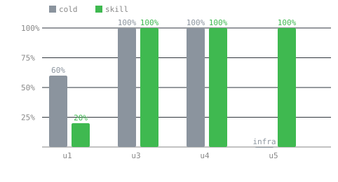

# Eval Results

**Run:** `matrix_20260929_201635` | pixeltable=0.7.8, fastapi=0.141.1, openai=3.16.2, python=3.12.14

- **Skill lift:** cold 30% -> skill 40% pass rate (n=20/20).
- **Functional lift:** cold 14% -> skill 31% on executed cells (n=14/16).
- **Looks-right-but-broken:** 22 cell(s) passed static checks yet failed execution -- what a good skill should reduce.
- **Spend:** $19.30 total, median 17 turns.

| Story | Context | n | Pass | Func ran | Mean score |
|---|---|---|---|---|---|
| u1 | cold | 5 | 60% [23-88%] | 3/5 | 3.9 |
| u1 | skill | 5 | 20% [4-62%] | 4/5 | 3.0 |
| u3 | cold | 5 | 60% [23-88%] | 1/5 | 4.7 |
| u3 | skill | 5 | 100% [57-100%] | 2/5 | 4.9 |
| u4 | cold | 5 | 0% [0-43%] | 5/5 | 3.8 |
| u4 | skill | 5 | 0% [0-43%] | 5/5 | 3.8 |
| u5 | cold | 5 | 0% [0-43%] | 5/5 | 3.5 |
| u5 | skill | 5 | 40% [12-77%] | 5/5 | 3.8 |

## Action items

Recurring failure reasons are candidates for skill, docs, or grader fixes. Investigate any reason that repeats.

- `u4`: query route response does not contain the inserted sku (10x)
- `u5`: below pass threshold (5x)
- `u5`: no articles table, found: [] (3x)
- `u1`: pxt schema update failed: pxt: 422 no model_base() found in /private/var/folders/s4/0zdx499s6sv3_0jll6ccdbh00000gn/T/pxt (2x)
- `u3`: POST hit a provider auth wall; treated as unmeasured (2x)
- `u1`: below pass threshold (2x)
- `u1`: Paragraph splitting is not currently supported for PDF documents. Please contact us at https://github.com/pixeltable/pix (1x)
- `u1`: no code or file/command evidence extracted (1x)

Raw data: `results/matrix_20260929_201635/results.json`; transcripts stay local.
